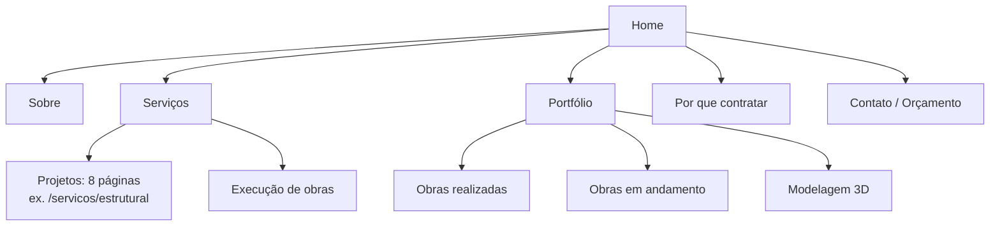

# PRD — Site Albano Luz

Sep 24, 2026 · @Levy

## Visão geral

O site da Albano Luz Engenharia deve transformar o portfólio em PDF (32 páginas) em uma vitrine online que gere pedidos de orçamento de arquitetos, construtoras e donos de obra.

**A empresa.** A Albano Luz tem mais de 7 anos de mercado e mais de 700 projetos entregues. O foco é cálculo estrutural para arquitetos e construtoras, unindo segurança e economia na construção civil. Também faz projetos complementares (fundação, elétrico, hidráulico, incêndio, arquitetura, 3D) e execução de obras.

**O problema.** Hoje a apresentação da empresa depende de um PDF enviado manualmente. Ele não aparece no Google, é pesado para abrir no celular e não tem um caminho claro até o contato.

**O objetivo do site.** Passar credibilidade técnica em poucos segundos, mostrar obras reais e levar o visitante ao WhatsApp ou ao formulário de orçamento.

## Objetivos e métricas de sucesso

O site tem sucesso se gerar contatos qualificados todo mês e substituir o PDF como material de apresentação.

| Objetivo | Métrica | Meta inicial (sugerida) |
| --- | --- | --- |
| Gerar leads | Cliques no WhatsApp + formulários enviados | 20 por mês a partir do 3º mês |
| Passar credibilidade | Tempo médio na página de Portfólio | Acima de 1 min |
| Ser encontrado no Google | Posição para "cálculo estrutural \[cidade\]" | Top 10 em 6 meses |
| Carregar rápido no celular | Lighthouse Performance (mobile) | 90 ou mais |
| Substituir o PDF | Link do site usado nas propostas comerciais | 100% das propostas |

As metas numéricas são sugestões para validar com o cliente.

## Público-alvo e personas

O portfólio fala com três públicos; o site deve priorizar os dois primeiros, que são o foco declarado da empresa.

| Persona | O que busca | O que o site precisa mostrar |
| --- | --- | --- |
| Arquiteto(a) | Parceiro de cálculo estrutural que respeite o projeto arquitetônico | Compatibilização, exemplos de pranchas 2D, prazos, canal rápido de contato |
| Construtora / incorporadora | Economia de material, segurança e acompanhamento de obra | Otimização estrutural, prédios entregues, obras em andamento, execução |
| Dono de obra / investidor | Alguém confiável para projetar e aprovar a obra inteira | Lista completa de projetos, aprovação em concessionária e Bombeiros, 3D |

A maioria acessa pelo celular, vindo do Instagram, do WhatsApp ou de uma busca no Google.

## Mapa do site

O site terá 6 páginas principais, 8 subpáginas de serviço e páginas individuais por obra.

Menu fixo: Sobre · Serviços · Portfólio · Por que contratar · Contato, mais botão "Solicitar orçamento" em destaque. Rodapé com contatos, redes, CNPJ/CREA e política de privacidade.

As 8 páginas de projeto são: Fundação, Estrutural (convencional e alvenaria estrutural), Elétrico, Hidráulico, Combate a Incêndio, Arquitetura, Projeto Executivo e Modelagem 3D/Maquete Eletrônica.

## Requisitos funcionais por página

Cada página termina com uma chamada para orçamento; o conteúdo vem do portfólio, indicado pela página do PDF.

### Home

1. Hero com foto de obra ou render 3D, título de valor (ex.: "Cálculo estrutural seguro e econômico para arquitetos e construtoras") e dois botões: WhatsApp e Solicitar orçamento.
2. Faixa de números: +7 anos de mercado, +700 projetos entregues (p. 3).
3. Resumo dos 4 diferenciais: Segurança, Experiência, Otimização Estrutural, Compatibilização Perfeita (p. 5).
4. Grade de serviços com ícone e link para cada subpágina (p. 6).
5. Destaque de 6 obras do portfólio com link para a galeria (p. 20–26).
6. Linha do tempo das etapas: Análise estrutural → Projeto personalizado → Consultoria técnica → Sustentabilidade → Acompanhamento em campo (p. 9).
7. CTA final e formulário curto.

### Sobre

1. Texto "Quem somos" (p. 3).
2. Missão, Visão e Valores em três colunas com ícones (p. 4).
3. Espaço para foto e mini-bio do responsável técnico, com número CREA (conteúdo a coletar).

### Serviços (índice + subpáginas)

1. Página índice separando Projetos e Execuções (p. 6).
2. Cada subpágina tem: descrição, lista de benefícios, exemplos de pranchas 2D ou fotos, perguntas frequentes e CTA.
3. Benefícios já prontos no PDF: Elétrico (p. 14), Hidráulico (p. 15), Executivo (p. 16), 3D (p. 17).
4. Modelagem 3D mostra o comparativo modelagem → renderização com slider antes/depois (p. 17–18) e renders internos (p. 19).
5. Execuções: fundação, obra comercial, obra industrial, ampliações e manutenção civil.

### Portfólio

1. Galeria com filtros: Realizadas, Em andamento, 3D/Renders, Pranchas técnicas.
2. Cada obra tem card com foto, tipo (residencial, comercial, multifamiliar), serviços prestados, cidade e ano.
3. Clique abre página da obra com galeria em lightbox.
4. Obras em andamento marcadas com selo "Em andamento — 2026" (p. 27–29).
5. Cadastro de novas obras pelo painel admin, sem precisar de programador.

### Por que contratar

1. Os 9 motivos do PDF em cards: Expertise técnica, Planejamento e gestão, Conformidade normativa, Soluções personalizadas, Redução de riscos, Inovação e tecnologia, Supervisão e qualidade, Economia de tempo e recursos, Responsabilidade e garantia (p. 30).
2. Espaço para depoimentos reais de clientes (a coletar).

### Contato / Orçamento

1. Formulário: nome, empresa, perfil (arquiteto, construtora, particular), serviços de interesse (múltipla escolha), cidade da obra, área aproximada em m², mensagem, anexo opcional (PDF/DWG até 20 MB).
2. Envio grava o lead no banco e notifica por e-mail e WhatsApp.
3. Contatos diretos: WhatsApp (11) 93274-2355, albano.luzengenharia@gmail.com, Instagram @albanoluz.insta (p. 31).
4. Botão flutuante de WhatsApp em todas as páginas, com mensagem pré-preenchida indicando a página de origem.

### Painel admin

1. Login restrito para a equipe da Albano Luz.
2. CRUD de obras (fotos, dados, status) e de depoimentos.
3. Lista de leads com status (novo, em contato, proposta enviada, fechado) e exportação CSV.

## Identidade visual

O site herda a identidade do portfólio: azul-marinho sobre cinza-concreto, com monograma AL serifado e sensação sóbria e técnica.

| Elemento | Diretriz |
| --- | --- |
| Cor primária | Azul-marinho, aprox. #0F2344 (confirmar com arquivo da marca) |
| Fundo | Cinza-concreto claro, aprox. #D9D9D7, com textura sutil |
| Apoio | Branco para cards; cinza-escuro #4A4A4A para sombras e textos secundários |
| Logo | Monograma AL em moldura + "ALBANO LUZ ENGENHARIA"; versão reduzida só com o monograma para favicon e menu mobile |
| Tipografia | Títulos: serifada elegante, na linha do logo (ex.: Cormorant ou Cinzel). Textos: sans-serif legível (ex.: Inter). Evitar tudo em maiúsculas como no PDF |
| Elementos gráficos | Faixas de título em azul sólido, molduras finas, fotos com sombra deslocada (padrão do PDF) |
| Imagens | Fotos reais de obra, drone e renders; pranchas 2D como textura técnica |

Os números de página em blocos azuis do PDF não devem ir para o site. Os textos precisam de revisão ortográfica (ex.: "Nossos serviços inclui", "evistamos").

## Requisitos não funcionais, stack e SEO

A stack segue o padrão da Bracav (React/Vite + Supabase + n8n), com pré-renderização das páginas públicas para o Google indexar.

**Stack proposta**

| Camada | Escolha |
| --- | --- |
| Front-end | React + Vite + TypeScript + Tailwind, com pré-renderização estática (ex.: vite-react-ssg) |
| Banco, auth e arquivos | Supabase: tabelas `obras`, `obra_fotos`, `depoimentos`, `leads`; Storage para fotos e anexos; RLS no painel |
| Automação | n8n: novo lead → e-mail + mensagem no WhatsApp da equipe |
| Hospedagem | VPS com EasyPanel ou Cloudflare Pages; CDN Cloudflare na frente |
| Analítica | GA4 + Meta Pixel, com eventos `clique_whatsapp` e `lead_enviado` |

**Desempenho e qualidade**

- Lighthouse mobile ≥ 90 em Performance, SEO e Acessibilidade.
- Imagens em WebP/AVIF, redimensionadas no upload, lazy-load fora da primeira dobra.
- Responsivo de 360 px a 1920 px; mobile-first.
- Acessibilidade WCAG 2.1 AA: contraste, textos alternativos nas fotos, navegação por teclado.
- LGPD: aviso de cookies, política de privacidade e consentimento no formulário.
- Formulário com proteção anti-spam (Cloudflare Turnstile).

**SEO**

- Uma página por serviço, com título e descrição próprios.
- Palavras-chave base: cálculo estrutural, projeto estrutural, projeto de fundação, alvenaria estrutural, projeto elétrico e hidráulico, AVCB/projeto de incêndio — combinadas com a cidade de atuação.
- Schema.org `ProfessionalService`/`LocalBusiness`, sitemap.xml, robots.txt, Open Graph para compartilhar no WhatsApp.
- Perfil no Google Meu Negócio ligado ao site.

## Escopo, cronograma e pendências

O MVP pode ir ao ar em cerca de 5 semanas, desde que o cliente entregue fotos e textos até o fim da semana 1.

**Dentro do escopo (MVP):** as 6 páginas principais, 8 subpáginas de serviço, portfólio com filtros, formulário com anexo, painel admin (obras, depoimentos, leads), SEO técnico e analítica.

**Fora do escopo:** blog, área do cliente para acompanhar obra, orçamento automático, versão em outro idioma, tour 3D/realidade virtual. Ficam como fase 2.

| Semana | Entrega |
| --- | --- |
| 1 | Kickoff, coleta de conteúdo, wireframes |
| 2 | Layout em alta (Home + uma página interna) e aprovação |
| 3 | Front-end das páginas públicas |
| 4 | Supabase, painel admin, formulário e automação n8n |
| 5 | Conteúdo final, SEO, testes, publicação |

**Pendências com o cliente**

- [ ] Cidade(s) de atuação: o WhatsApp é DDD 11 (SP), mas não há endereço no PDF
- [ ] Domínio: o PDF cita www.albanoluz.com — confirmar se já está registrado e com quem
- [ ] No PDF, os ícones de site e Instagram estão trocados; confirmar o @ correto
- [ ] Arquivos da marca: logo em vetor (SVG/AI), códigos de cor e fontes
- [ ] Fotos originais em alta resolução (as do PDF estão comprimidas)
- [ ] Nome, cidade, ano e serviços de cada obra do portfólio
- [ ] Nome e CREA do responsável técnico, CNPJ
- [ ] 3 a 5 depoimentos de clientes, com autorização
- [ ] Lista de construtoras/arquitetos parceiros que podem aparecer como logos
- [ ] E-mail com domínio próprio (hoje é Gmail)
